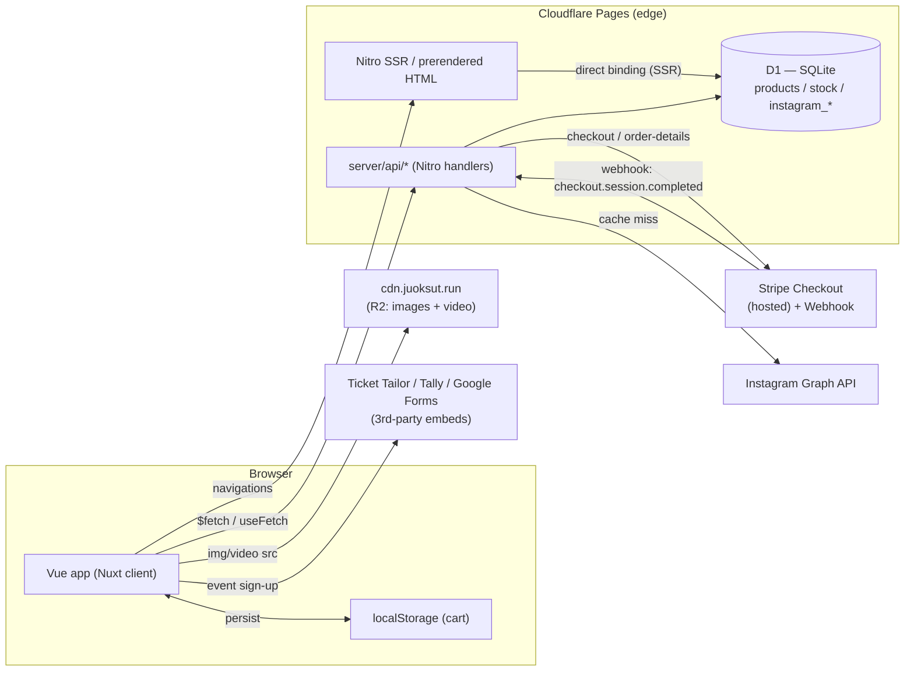
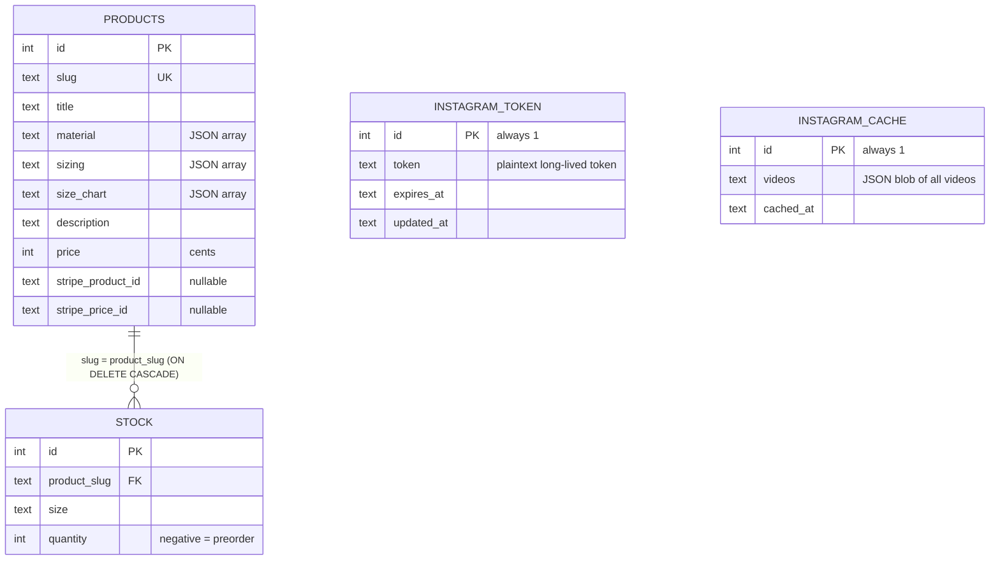
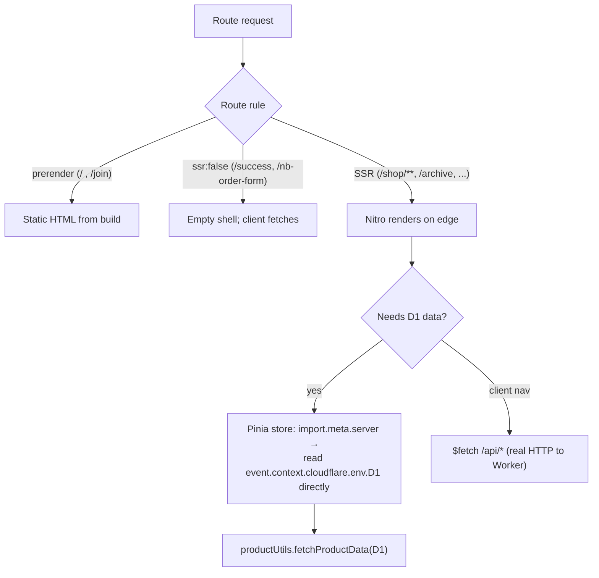
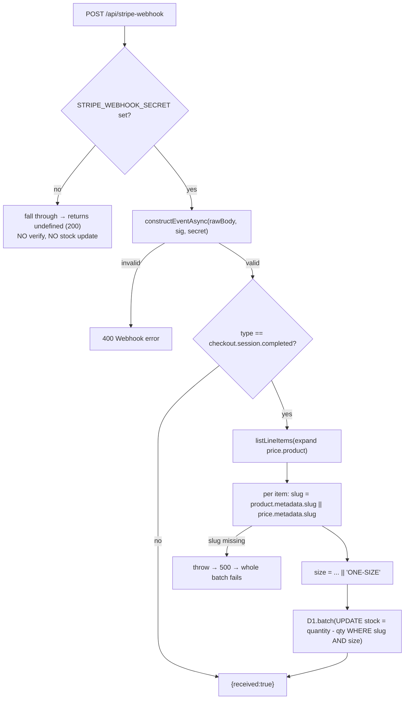
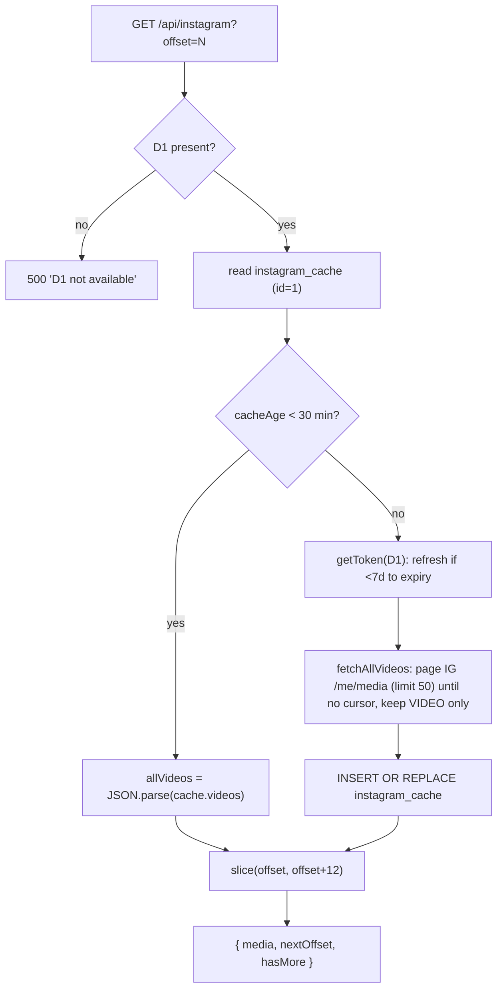

# JUOKSUT — Architecture

> Deep architecture reference produced from a full read of the codebase. Every non-obvious claim
> cites `file:line`. See `docs/security-review.md` for the security analysis and `docs/roadmap.md`
> for prioritized follow-ups. Companion operational notes live in the repo-root `CLAUDE.md`.

## 1. What it is

A single Nuxt 3 application that serves both the public JUOKSUT Run Club site and its merch shop.
It is a hybrid-rendered app (prerender + on-demand SSR + a couple of CSR-only routes) running on the
Cloudflare edge, with a small SQLite (D1) database for product/stock data, an R2-backed CDN for all
media, and Stripe Checkout for payments.

**Design philosophy:** hand-rolled, minimal dependencies. Four runtime deps only
(`@nuxt/image`, `@stripe/stripe-js`, `pinia-plugin-persistedstate`, `stripe` — `package.json:18-23`).
There is no admin UI, no auth/account system, and no first-party storage of customer PII — Stripe is
the system of record for orders/customers.

## 2. Stack & hosting

| Concern        | Choice                                           | Where                                                    |
| -------------- | ------------------------------------------------ | -------------------------------------------------------- |
| Framework      | Nuxt 3 (Vue 3 + Nitro)                           | `nuxt.config.ts`                                         |
| Hosting        | Cloudflare Pages                                 | `wrangler.toml`, `nitro.preset`                          |
| Nitro preset   | `cloudflare_pages`, `nodeCompat: true`           | `nuxt.config.ts:13-20`                                   |
| Database       | Cloudflare D1 (`juoksut-products`), binding `D1` | `wrangler.toml:5-9`                                      |
| Media/CDN      | Cloudflare R2 via `cdn.juoksut.run`              | `nuxt.config.ts:71-73`, `server/utils/productUtils.js:1` |
| Payments       | Stripe Checkout (hosted)                         | `server/api/checkout.js`, `stripe-webhook.js`            |
| State          | Pinia (+ persistedstate for cart)                | `stores/`, `nuxt.config.ts:8`                            |
| Styling        | Tailwind v3 (pinned)                             | `tailwind.config.js`, `package.json:41-43`               |
| Lint           | `@antfu/eslint-config`                           | `eslint.config.mjs`                                      |
| Pkg mgr / Node | Yarn 4 (Corepack) / Node 20                      | `package.json:5`, `.nvmrc`                               |



### Render modes (`nuxt.config.ts:22-32`)

- **Prerendered** (build-time static): `/`, `/join`.
- **On-demand SSR**: `/shop`, `/shop/**`, `/archive` (SSR is kept so crawlers get OG/meta tags).
- **CSR only** (`ssr: false`): `/success`, `/nb-order-form`.
- Everything else defaults to SSR.

## 3. Data model (D1)

Schema in `d1/schema.sql` (note: `d1/` is **gitignored**, last line of `.gitignore`).



Notes (`d1/schema.sql`):

- `products.slug` is the natural key used everywhere (carts, stock FK, Stripe metadata, CDN paths).
- `stock.quantity` has **no `CHECK` constraint** (`schema.sql:42`) — negative is a valid "preorder"
  state, and the webhook can drive it arbitrarily negative.
- **No index** on `stock.product_slug` (`schema.sql:38-44`); the hot read joins on it.
- `instagram_token`/`instagram_cache` are single-row singletons (id=1).

### How stock + product data is read (`server/utils/productUtils.js`)

`fetchProductData(D1, slug?)` issues one SELECT that `LEFT JOIN`s stock and aggregates sizes with
`JSON_GROUP_ARRAY(JSON_OBJECT('size', …, 'quantity', …) ORDER BY <size rank>)` plus
`COALESCE(SUM(s.quantity),0) AS totalStock` (`productUtils.js:4-30`). The slug filter is a
parameterized `WHERE p.slug = ?` (`productUtils.js:24,28`).

`transformProductData(product)` (`productUtils.js:32-45`):

- `JSON.parse`s `material`/`sizing`/`size_chart`/`stock`,
- converts `price` cents→euros (`/100`, line 41),
- sets `img = {cdnBaseUrl}/{slug}/1.png` (line 42),
- renders the description as `description.split('\n').map(p => '<p>'+p+'</p>').join('')` (line 43).

> **"How X actually works" — product descriptions.** Two line-break conventions coexist in the seed
> data: literal `\n` (24 occurrences — split into `<p>` paragraphs here) and `<br>` (33 occurrences —
> left intact and rendered by `v-html` at `pages/shop/[...slug].vue:71`). So the `split('\n')` is
> **functional, not dead code**; it just doesn't cover the `<br>` rows.

> **Gotcha — phantom stock row.** For a product with zero stock rows, the `LEFT JOIN` +
> `JSON_GROUP_ARRAY` emits `[{"size":null,"quantity":null}]` instead of `[]`
> (`productUtils.js:8-25`). Live case: `fastlane-track-bag` in the seed has no stock rows.

## 4. Request / render flow



**The central SSR gotcha** (documented in `stores/products.js:29-39, 72-82`): Nitro's internal
`$fetch('/api/...')` spawns a sub-request whose event lacks `event.context.cloudflare`, so `D1` is
`undefined` inside the handler. The stores work around it by detecting `import.meta.server`, reading
the binding off `useRequestEvent()`, and calling the D1 utilities directly. Client navigations use
`$fetch`/`useFetch` to the real Worker routes, where the binding is present.

> **Caveat (verified 2026-06):** in the _current_ Nitro/Pages runtime the binding **is** actually
> available to an internal `useFetch('/api/...')` during SSR — `archive.vue` proves it (§11). So the
> products-store bypass may be historical (it was added when internal `$fetch` _did_ lose D1, commit
> `bfe332e`). It's harmless; treat the "loses D1" rule as version-dependent, not absolute. See §11.

- `stores/products.js` — normalized `products` map keyed by slug; `fetchProducts()` and
  `fetchSingleProduct(slug)` both have the SSR-bypass branch. `fetchSingleProduct` additionally
  fetches `/api/products/{slug}/images` for images 2–7 and tolerates failure (`:90-100`).
- `pages/shop/index.vue` uses `callOnce(() => productStore.fetchProducts())` (`:67-69`) then sorts by
  `id` desc.
- `pages/shop/[...slug].vue` calls `fetchSingleProduct(slug[0])` with an all-products fallback, and
  throws a real `createError({ statusCode: 404 })` for a genuinely missing product (`:172-189`).

The root `app.vue` wraps everything in a `LoadingScreen` (shown on reload + during route loading via
`useLoadingIndicator`) and sets the global `titleTemplate` (`app.vue:13-15`).

## 5. Commerce flow: browse → cart → checkout → order

```mermaid
sequenceDiagram
  participant U as Browser
  participant Shop as shop/[...slug].vue
  participant Cart as cart store (localStorage)
  participant CO as POST /api/checkout
  participant D1 as D1
  participant S as Stripe
  participant WH as POST /api/stripe-webhook

  U->>Shop: view product (SSR)
  Shop->>Cart: addItem({slug,size,price,title,img,qty})
  Note over Cart: persisted to localStorage (pick: ['items'])
  U->>Cart: open cart, click Checkout
  Cart->>CO: { items: cart.items }
  CO->>D1: fetchProductData(slug) per item
  CO->>CO: validate stock; re-read price from D1
  CO->>S: checkout.sessions.create (line_items, 30-min expiry)
  S-->>CO: session.url
  CO-->>Cart: { url }
  Cart->>U: window.location.href = url
  U->>S: pay on Stripe hosted page
  S-->>U: redirect /success?session_id=...
  U->>CO: (success.vue) GET /api/order-details?session_id
  S-->>WH: checkout.session.completed (async)
  WH->>WH: verify signature (raw body)
  WH->>S: listLineItems(expand price.product)
  WH->>D1: batch UPDATE stock = quantity - qty
```

Client side:

- `components/Cart.vue:111-137` — `handleCheckout()` does
  `useFetch('/api/checkout', { method:'POST', body: JSON.stringify({ items: cart.items }) })`, shows
  `checkoutError` on failure, and on success sets `window.location.href = data.value.url` (`:126`).
- `stores/cart.js` — `addItem` stores only `{slug,size,price,title,img,quantity}` (`:27-34`);
  totals are computed getters (`:12-13`); items persisted to localStorage (`:81-84`); `clearCart`
  also removes the `cart` key (`:75-78`). `success.vue:46` calls `cart.clearCart()`;
  `cancel.vue` does **not**.

## 6. Stripe flow end-to-end

### 6.1 Checkout (`server/api/checkout.js`)

For each `body.items[i]` (`:20-62`):

1. `fetchProductData(D1, item.slug)` → 400 if unknown (`:21-24`).
2. Stock check: `if (!stock || stock.quantity < item.quantity) → 400` (`:28-35`).
3. **Price authority — two paths:**
   - If `product.stripe_price_id` set → line item `{ price: stripe_price_id, quantity }`
     (`:37-43`) — **no metadata attached here**.
   - Else inline `price_data` with `unit_amount: product.price * 100` (price comes from D1, not the
     client) and `product_data.metadata = { slug, size }` (`:46-60`).
4. Create session: `mode:'payment'`, success/cancel URLs from `getRequestURL(event).origin`
   (`:64-90`), name + phone collection, required ToS consent, an optional "Order note" custom field,
   and `expires_at = now + 60*30` = **30 min** (the inline comment "20 min" is wrong, `:89`).

Client-supplied `price` (in the cart) is never used for charging — verified server authority is the
single most important correctness property here and it holds.

### 6.2 Webhook (`server/api/stripe-webhook.js`)



What's correct: signature verified over the **raw** body with the async verifier (`:13,18`), only
`checkout.session.completed` acts (`:22`), all updates run as one atomic `D1.batch` (`:57`),
verification failure → 400 (`:69`).

What's fragile (all detailed in the security review):

- **Silent no-op if `STRIPE_WEBHOOK_SECRET` is unset** — the whole handler is inside
  `if (endpointSecret)` with no `else` (`:15-71`); it returns `undefined`/200 and never decrements.
- **Not idempotent** — no event/session dedup; a Stripe retry/duplicate decrements stock again
  (`:34-57`).
- **Metadata dependency for pre-created prices** — line items created via `stripe_price_id` carry no
  metadata from checkout (§6.1), so `slug` must exist on the Stripe-side Product/Price or the
  handler throws "Missing slug metadata" (`:47-49`) and the whole batch fails. The only such
  products are `all-stars-camp` and `runway-riga` (event/trip registrations).
- **No floor** — `quantity = quantity - ?` (`:51-53`) can over-decrement past zero.

### 6.3 Order details (`server/api/order-details.js`)

`GET /api/order-details?session_id=…` retrieves the Stripe session (expanding line items) and
returns a **narrowed** projection — `id, amount_total, currency, customer_details, line_items[]`
(`:20-30`). `customer_details` is the full Stripe object (name/email/phone/address). Access is gated
only by possession of the high-entropy `cs_…` session id (no auth). `success.vue:52` calls it with
the `session_id` from the URL.

## 7. Instagram integration (`server/api/instagram.js`)



- **Token** (`:8-36`): read from `instagram_token` (id=1); if `<7 days` to expiry, call
  `refresh_access_token` and persist the new token/expiry. Token is plaintext in D1 and passed as a
  URL query param to the Graph API; it is never returned to the client (response is only
  `{media, nextOffset, hasMore}`).
- **Cache** (`:65-80`): 30-min TTL; full video list stored as one JSON blob; pagination is in-memory.
- **Consumers:** `pages/index.vue:63-75` fetches in `onMounted` (client-only) and picks a random
  video for the hero, falling back to `cdn.juoksut.run/juoksut.mp4`. `pages/archive.vue:49` uses
  `useFetch` at **setup** (SSR) then builds a randomized editorial grid with `IntersectionObserver`
  infinite scroll (`:109-137`). This SSR fetch **does** get the D1 binding and works (verified — see
  §11): the payload is embedded in the SSR HTML and reused on the client.

## 8. Event registration / ticketing (third-party)

Not first-party — no backend code is involved:

- **Fastlane Friday** (`pages/fastlane-friday.vue:150-200`) — injects the Ticket Tailor widget
  script on click, with a 5s fallback link and a `<noscript>` link.
- **nb-order-form** (`pages/nb-order-form.vue`) — Tally iframe + `Tally.loadEmbeds()` on mount.
- **live-love-lightspeed** (legacy, `pages/live-love-lightspeed.vue`) — posts to a Google Form via a
  hidden iframe; contains dead/commented `onSubmit` code.

Trip registrations `all-stars-camp` / `runway-riga` are the exception: they DO use first-party Stripe
Checkout (with `stripe_price_id`), collecting shirt size / race distance via the checkout note field.

## 9. R2 / CDN

All media is served from `cdn.juoksut.run` (R2-backed, public-by-design — only marketing assets):

- Product images: `/products/{slug}/{1..7}.png` (`server/utils/productUtils.js:1,42`). Image `1` is
  assumed; images 2–7 are discovered by HEAD-probing in `server/api/products/[slug]/images.js`.
- Video: `/juoksut.mp4` (hero fallback `pages/index.vue:58`, footer `components/FooterVideo.vue:12`).
- Social/marketing: `og-image.jpg`, `fastlane-friday.jpg`.
- `@nuxt/image` is restricted to this domain (`nuxt.config.ts:71-73`).

## 10. Build, deploy & tooling

- **Build:** `nuxt build --preset=cloudflare_pages` → `dist/` (`package.json:7`, `wrangler.toml:2`).
- **Deploy:** Cloudflare Pages connected to the Git repo; build command `yarn build`, output `dist`,
  D1 bound as `D1`, Stripe secrets in the Pages dashboard. Non-main branches get preview builds.
- **Local Pages runtime:** `yarn preview` = build + `wrangler pages dev` (`package.json:10`).
- **Local D1:** `db:reset:local` / `db:seed:local` / `dev:fresh` (`package.json:14-16`).
- **Lint:** `@antfu/eslint-config`, stylistic on, `eqeqeq` error, custom Vue block order
  (`eslint.config.mjs`).
- **Pin:** Tailwind forced to v3 via `resolutions` (`package.json:41-43`).
- `env.d.ts` augments `h3`'s `H3EventContext` with the `cloudflare.env.D1` typing.

## 11. Open questions / couldn't fully trace

1. **`archive.vue` SSR Instagram fetch — RESOLVED (works; the old hypothesis was wrong).** Initial
   reading suggested `useFetch('/api/instagram')` at setup would hit the documented D1-in-SSR
   limitation and fail server-side. **Verified otherwise** (2026-06, against `wrangler pages dev` with
   a seeded local D1, and confirmed by the maintainer on live `juoksut.run`): the SSR `useFetch`
   **succeeds** — the rendered `/archive` HTML embeds the full payload (12 `media_url` entries,
   `nextOffset`/`hasMore`), no error state, deterministic across runs. So **the D1 binding _is_
   available in the internal `useFetch` sub-request in the current Nitro/Pages runtime.** On the
   client, `useFetch` hydrates from that payload and `onMounted` builds the grid — end-to-end working.
   The only failure mode is operational (no Instagram token / empty cache → 503 → "Could not load
   archive", which `useFetch` won't auto-retry on the client).
   _Side note:_ git history (`bfe332e`) shows internal `$fetch` _did_ lose D1 at some point, so the
   runtime behavior changed. That means the `stores/products.js` SSR bypass (§4) may now be
   historical/unnecessary — but it's harmless, and `$fetch`-from-a-store vs `useFetch`-from-a-component
   weren't proven equivalent here, so leave it unless you explicitly re-test (temporarily remove the
   bypass and confirm `/shop` still SSRs products).
2. **Pre-created-price webhook metadata.** Whether `all-stars-camp`/`runway-riga` decrement stock
   correctly depends on `slug` metadata existing on the Stripe **Product/Price** objects, which is
   not visible in the repo. Confirm in the Stripe dashboard (see security review / roadmap).
3. **`dist/sitemap.xml` vs `public/sitemap.xml`.** A `dist/sitemap.xml` was observed in a local
   build; the committed source of truth is the hand-maintained `public/sitemap.xml`. Whether the
   build copies/augments it (and whether the two can drift) wasn't fully traced — Nuxt core has no
   native sitemap and the `@nuxtjs/sitemap` module was removed.
4. **`CNAME` relevance.** `CNAME` (`juoksut.run`) is a GitHub-Pages convention and appears unused on
   Cloudflare Pages, but I can't prove no tooling reads it — verify before removing.
5. **Concurrency model of D1.batch under retries.** `D1.batch` is atomic per delivery; the
   cross-delivery idempotency gap (§6.2) is established, but the exact Stripe retry cadence/dedup
   behavior in production wasn't observed, only reasoned from Stripe's documented at-least-once
   delivery.
