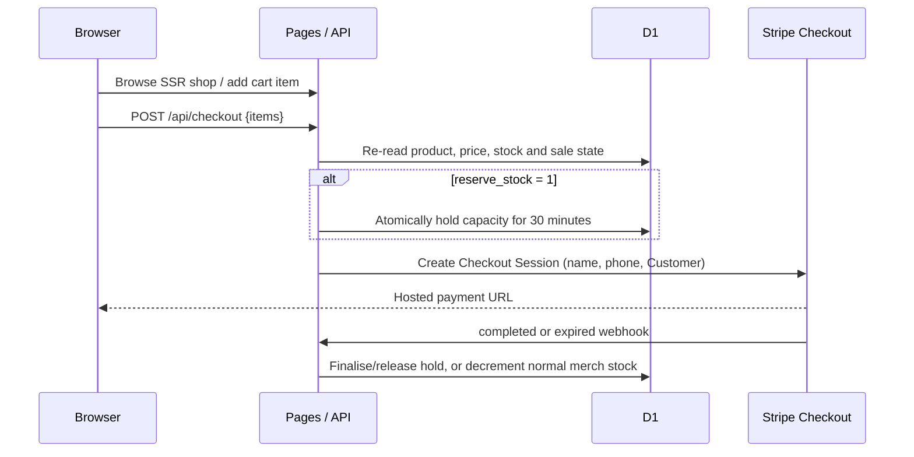

# JUOKSUT — Architecture

> Current architecture reference, updated 23 August 2026. Operational guidance
> for coding agents lives in [`CLAUDE.md`](../CLAUDE.md); public local and
> restricted-access setup lives in [`README.md`](../README.md).

## Application and hosting

JUOKSUT is a Nuxt 4 (Vue 3 + Nitro) website and webshop deployed to Cloudflare
Pages. It uses on-demand SSR where current product data and social metadata
matter, and prerenders selected stable pages.

| Concern | Current implementation |
| --- | --- |
| Runtime | Nuxt 4 / Nitro, Cloudflare Pages preset with Node compatibility |
| Local toolchain | Node 22, Yarn 4 through Corepack |
| Database | Cloudflare D1 `juoksut-products`, bound as `D1` |
| Media | Public Cloudflare R2 assets at `https://cdn.juoksut.run` |
| Payments and buyer records | Stripe Checkout and Stripe Customers |
| Client state | Pinia; cart persists only in browser localStorage |

`/` and `/join` are prerendered. `/shop`, `/shop/**`, and `/archive` render on
demand. `/success` and `/nb-order-form` are client-only. `/orders` permanently
redirects to `/terms-and-conditions`.

Security response headers are configured in `nuxt.config.ts` for every route:
`nosniff`, a strict referrer policy, same-origin framing, and a report-only CSP.
The CSP should be checked for violations before it is enforced.

## D1 data model

`d1/schema.sql` is committed and is the recoverable schema source of truth.
`d1/seed.sql` is intentionally ignored: it is a local development fixture, not
a production migration or source of production truth. Never run the whole
schema file against remote D1 because its initial drops are for local reset.

| Table | Purpose |
| --- | --- |
| `products` | Catalogue data; prices are integer cents. Optional Stripe product/price IDs, checkout fields, reservation flag, and sale-start timestamp live here. |
| `stock` | Per-product-size quantity. Negative quantities intentionally mean preorder/coming soon. A unique `(product_slug, size)` index prevents duplicates. |
| `checkout_reservations` | Ten-minute, non-PII capacity holds for products using `reserve_stock = 1`. |
| `processed_events` | Stripe webhook event IDs, for at-least-once delivery idempotency. |
| `instagram_token` / `instagram_cache` | One Instagram token and a cached media payload. |

`products.checkout_fields` is JSON for structured registration choices, such
as a camp shirt-size dropdown. This is deliberately separate from `stock`: the
answer is collected by Stripe Checkout, not represented as an inventory size.
`products.sales_start_at` is an optional Unix timestamp; the UI counts down to
it and checkout rejects an earlier request server-side.

## Product, cart, and checkout flow


```mermaid
sequenceDiagram
  participant B as Browser
  participant A as Pages / API
  participant D as D1
  participant S as Stripe Checkout

  B->>A: Browse SSR shop / add cart item
  B->>A: POST /api/checkout {items}
  A->>D: Re-read product, price, stock and sale state
  alt reserve_stock = 1
    A->>D: Atomically hold capacity for 30 minutes
  end
  A->>S: Create Checkout Session (name, phone, Customer)
  S-->>B: Hosted payment URL
  S->>A: completed or expired webhook
  A->>D: Finalise/release hold, or decrement normal merch stock
```

The browser never controls the charged price. `server/api/checkout.js` validates
the request, reads each product again from D1, checks stock, and builds the
Stripe line items from that data. It also requires a buyer name and phone number
and uses `customer_creation: 'always'`, so completed purchases are visible under
Stripe Customers instead of only anonymous checkout records.

### Stock rules

- Normal merchandise is checked before Checkout and decremented after successful
  payment by the webhook. A rare concurrent last-unit oversell remains possible.
- A product with `reserve_stock = 1` is intended for limited registrations. Its
  place is atomically removed before the Checkout URL is returned, held for ten
  minutes, then marked paid on completion or restored on expiry/fallback cleanup.
- Such registrations must be bought one at a time so one Stripe custom-field
  answer belongs to one participant.
- A limited registration must have a positive price. This prevents accidentally
  opening a free Checkout while launch details are incomplete.

### Stripe integration

The live webhook endpoint is `/api/stripe-webhook`. It verifies the raw payload
with `STRIPE_WEBHOOK_SECRET`, claims the Stripe event ID in `processed_events`,
and only then changes stock. It needs these two Stripe event types:

- `checkout.session.completed`
- `checkout.session.expired`

Reusable Stripe Prices are mapped to a D1 product by the unique
`products.stripe_price_id`; this is preferred to Stripe dashboard metadata.
Inline prices carry `slug` and `size` metadata as a fallback. Do not rely on a
manually entered Stripe metadata slug for inventory correctness.

Stripe is the system of record for payments, orders, customers, names, phone
numbers, and email addresses. D1 reservations contain no buyer PII. The success
endpoint returns the order's payment status plus only the name/email and order
summary needed by its page, not phone or address.

## Operations

Cloudflare Pages deploys `main`; other branches receive previews. Product and
stock administration happens through targeted D1 commands, not a public admin
API. Images are uploaded to R2 and served from the public CDN.

For a remote command, use the wrappers rather than exporting credentials into a
shell:

```bash
bash scripts/wrangler-remote.sh d1 execute juoksut-products --remote --command "SELECT 1"
bash scripts/stripe-management.sh node scripts/stripe-inspect.mjs catalog
```

The Keychain service names and wrappers are safe to commit and document. API
tokens, secret keys, webhook secrets, Keychain output, and customer data are
not. Restrict Cloudflare tokens to the JUOKSUT account/resources and use live
Stripe access only for an explicitly approved production action.

## External integrations

- Instagram Graph API feeds the homepage video and archive. The token is stored
  server-side in D1; a 30-minute D1 cache reduces API calls.
- Fastlane Friday uses Ticket Tailor. The legacy NB order-form route remains as
  a Tally-form reference. `live-love-lightspeed` is a legacy Google Forms page.
- All product and marketing media are public R2 assets. Do not put private
  customer documents in that bucket.

## Deliberate limitations

- No first-party accounts, admin UI, or order database: this keeps customer PII
  and payment records in Stripe.
- The static sitemap and robots file in `public/` must be updated manually when
  public routes change.
- Product descriptions are trusted admin-authored HTML rendered with `v-html`.
  Do not turn them into user-submitted content without sanitisation.
